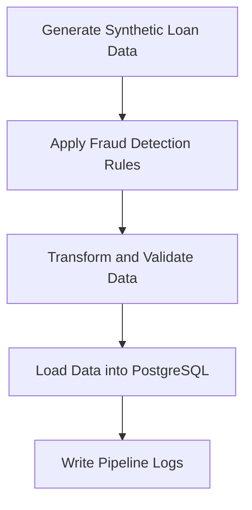

# 🧠 Fraud Detection ETL Pipeline

### Python + PostgreSQL

## 📌 Project Overview

This project is a beginner-friendly **Data Engineering ETL pipeline** that simulates a real-world loan fraud detection workflow using **Python** and **PostgreSQL**.

The pipeline generates synthetic loan data, applies basic fraud detection rules, and loads the processed data into a PostgreSQL database.

---

## 🎯 Project Goal

The goal of this project is to practice building a simple but realistic ETL pipeline with clean project structure, database integration, and logging.

| Goal                        | Description                                      |
| --------------------------- | ------------------------------------------------ |
| Build an ETL pipeline       | Extract, transform, and load loan data           |
| Generate synthetic data     | Create sample loan records for testing           |
| Apply fraud rules           | Flag suspicious loans based on business logic    |
| Store data in PostgreSQL    | Load transformed data into a relational database |
| Add logging                 | Track pipeline execution using structured logs   |
| Practice clean architecture | Organize code using a modular `src/` structure   |

---

## 🏗️ ETL Architecture

The project follows a simple ETL architecture:

```text
Extract → Transform → Load → PostgreSQL
```

### Pipeline Flow



---

## 📊 Dataset

The project uses synthetic loan data generated with Python.

| Column         | Description                           |
| -------------- | ------------------------------------- |
| `loan_id`      | Unique loan identifier                |
| `income`       | Applicant income                      |
| `loan_amount`  | Requested loan amount                 |
| `credit_score` | Applicant credit score                |
| `fraud`        | Fraud flag based on detection rules   |
| `created_at`   | Timestamp when the record is inserted |

---

## ⚙️ Fraud Detection Logic

A loan is marked as fraud when it meets the following conditions:

| Rule                 | Description                       |
| -------------------- | --------------------------------- |
| `income < 20000`     | Applicant has very low income     |
| `credit_score < 500` | Applicant has a poor credit score |

### Fraud Rule

```text
If income is less than 20000
AND credit_score is less than 500
THEN mark loan as fraud
```

---

## 🧱 Tech Stack

| Tool                | Purpose                              |
| ------------------- | ------------------------------------ |
| Python              | Main programming language            |
| Pandas              | Data manipulation and transformation |
| PostgreSQL          | Database for storing loan records    |
| psycopg2            | PostgreSQL connector for Python      |
| Logging             | Tracks pipeline execution            |
| RotatingFileHandler | Manages log file rotation            |

---

## 📁 Project Structure

| Folder / File | Purpose                              |
| ------------- | ------------------------------------ |
| `fraud_etl/`  | Root directory of the project        |
| `main.py`     | Entry point for running the pipeline |

### Source Code

| File               | Purpose                                                 |
| ------------------ | ------------------------------------------------------- |
| `src/extract.py`   | Generates synthetic loan data                           |
| `src/transform.py` | Applies cleaning, validation, and fraud detection rules |
| `src/load.py`      | Loads transformed data into PostgreSQL                  |
| `src/logger.py`    | Handles pipeline logging                                |

### Configuration

| File           | Purpose                             |
| -------------- | ----------------------------------- |
| `config/db.py` | Stores database connection settings |

### Logs

| File                | Purpose                   |
| ------------------- | ------------------------- |
| `logs/pipeline.log` | Stores ETL execution logs |

---

## ▶️ How to Run the Project

Follow the steps below to run the project locally.

### 1. Install Dependencies

```bash
pip install pandas psycopg2-binary
```

### 2. Create the PostgreSQL Database

```sql
CREATE DATABASE fraud_db;
```

### 3. Create the Loans Table

Connect to the `fraud_db` database and run:

```sql
CREATE TABLE IF NOT EXISTS loans (
    loan_id UUID PRIMARY KEY,
    income INT,
    loan_amount INT,
    credit_score INT,
    fraud INT,
    created_at TIMESTAMP DEFAULT NOW()
);
```

> If your Python code generates integer IDs instead of UUIDs, change `loan_id UUID` to `loan_id INT`.

### 4. Run the Pipeline

```bash
python main.py
```

---

## 📊 Output Example

After running the pipeline, records should be inserted into the `loans` table.

You can check the result with:

```sql
SELECT COUNT(*) FROM loans;
```

You can also preview the inserted records:

```sql
SELECT * FROM loans LIMIT 10;
```

---

## 📌 Key Features

| Feature                   | Description                                                          |
| ------------------------- | -------------------------------------------------------------------- |
| Modular ETL architecture  | Code is separated into extract, transform, load, and logging modules |
| Synthetic data generation | Creates sample loan records for testing                              |
| Fraud detection rules     | Applies simple business logic to identify risky loans                |
| PostgreSQL integration    | Stores transformed records in a database                             |
| Structured logging        | Tracks pipeline activity and errors                                  |
| Clean project structure   | Uses a beginner-friendly `src/` pattern                              |

---

## 💡 What I Learned

This project helped me practice important Data Engineering concepts.

| Concept                | What I Practiced                                        |
| ---------------------- | ------------------------------------------------------- |
| ETL pipelines          | Moving data through extract, transform, and load stages |
| Data transformation    | Applying business rules to raw data                     |
| PostgreSQL integration | Connecting Python to a relational database              |
| Logging                | Tracking pipeline execution and errors                  |
| Project organization   | Structuring a clean Python data project                 |
| Fraud detection logic  | Creating rule-based flags for suspicious records        |

---

## 📌 Future Improvements

| Improvement                 | Goal                                              |
| --------------------------- | ------------------------------------------------- |
| Add Apache Airflow          | Orchestrate and schedule the ETL pipeline         |
| Add Docker support          | Make the project easier to run in any environment |
| Build a Streamlit dashboard | Visualize fraud records and loan metrics          |
| Add data validation         | Check data quality before loading                 |
| Add environment variables   | Store database credentials securely               |
| Add unit tests              | Improve pipeline reliability                      |

---

## 👩‍💻 Author

**Beginner Data Engineering Portfolio Project**

This project was created to demonstrate practical skills in Python, PostgreSQL, ETL pipeline design, data transformation, and structured logging.

